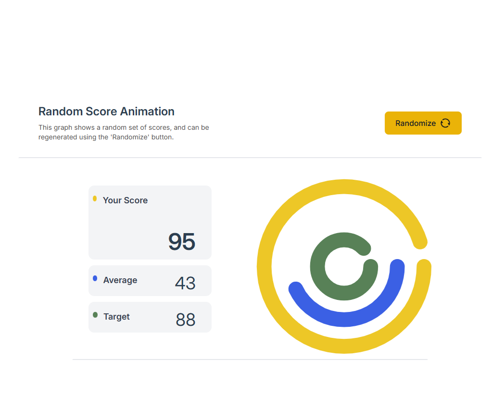

# 🎯 Random Score Animation

A fun and interactive score animation app built with **Vue 3 (Composition API)**, **Tailwind CSS**, and **SVG**. This app animates score updates using dynamic SVG circles, providing a clean, responsive, and engaging UI.

---

## 🌐 Live Demo

The app is deployed and accessible online via Netlify:

🔗 **[View Live Site](https://randomscoreanimate.netlify.app/)**

## 🌟 Features

- 🎲 Randomized score updates  
- 🌀 SVG-based animated donut chart circular progress  
- ⚙️ Vue 3 Composition API Component structure  
- 🎨 Tailwind CSS for utility-first design  
- ✅ Easily extendable component-based architecture  

---

## 📸 Preview

  
*A beautifully animated circular score display using SVG and Tailwind.*

---

## 🚀 Getting Started

### 1. Clone the Repository

```bash
git clone https://github.com/joedewet36/random-chart-vue.git
cd random-chart-vue
```
### 2. Install Dependencies
Make sure you have Node.js installed.
```bash    
npm install
```
### 3. Run the App in Development Mode
```bash    
npm run serve
```
Then open http://localhost:8080 in your browser to view the app.

### 🛠️ Technologies Used
- Vue.js 3 with Composition API 
- Tailwind CSS
- SVG – Animated circular progress
- Vue CLI – Project scaffolding and build tool

### 🧠 Design Decisions
- The Composition API was chosen for cleaner logic organization and reusability.
- Tailwind CSS simplifies styling and ensures a consistent, utility-based design.
- SVG enables lightweight, scalable, and visually rich animations for score feedback.
- Project is structured for extensibility and easy testing with Vue’s standard tooling.

### 📦 Building for Production
```bash    
npm run build
```